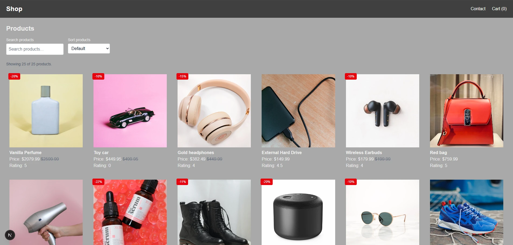

<p>
  
</p>

# JavaScript Frameworks Assignment

An online shop built with Next.js, React, TypeScript, and Tailwind CSS.

The application allows users to browse products, search and sort products, view individual product pages, add items to a shopping cart, complete checkout, and submit contact forms.

---

## Live Site

[View live site](https://vold-art.github.io/javascript-frameworks-assignment/)

---

## Repository

[View GitHub repository](https://github.com/Vold-Art/javascript-frameworks-assignment)

---

## Running the project

### Install dependencies

```bash
npm install
```

### Run the development server

```bash
npm run dev
```

### Open

http://localhost:3000

### Running tests

```bash
npm test
```

---

## Available Scripts

```bash
npm run dev              # Start Tailwind in watch mode
npm run build            # Build and minify CSS for production
npm start                # Start the production server
npm test                 # Run Jest tests
npm lint                 # Run ESLint
```

---

## Technologies used

- Next.js
- React
- TypeScript
- Tailwind CSS
- React Context API
- Jest
- React Testing Library

---

## Portfolio 2 Improvements

For Portfolio 2, the application was reviewed and improved to provide a better user experience and accessibility.

Improvements include:

Improved accessibility of the product listing page.
Added visible labels for search and sorting controls.
Added semantic loading and error states using ARIA roles.
Added a live product count that updates when filtering.
Improved keyboard accessibility for product cards.
Removed unnecessary 0% discount badges from products without discounts.
Improved typography consistency in the site header.
Improved readability of filtering controls.

These changes improve usability, accessibility, and the overall presentation of the application.

---

## Features

- Fetch products from the Noroff Online Shop API
- Product grid with search and sorting
- Dynamic product detail pages
- Shopping cart using React Context
- Checkout success page
- Contact form with validation
- Toast notifications for user actions
- Component tests using Jest and React Testing Library

---

# Author

Arnt Helge Vold
Vold-Art @ GitHub
FED2 | Noroff
